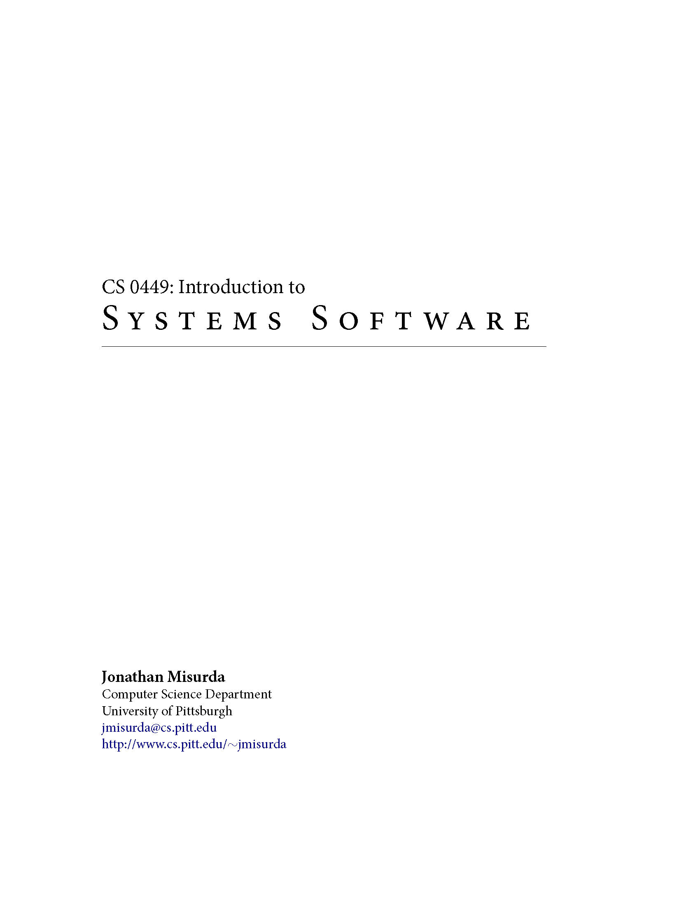

[Sign up for **Peer Tutoring** on Navigate](https://pitt.guide.eab.com/){: target="\_blank"}{: .text-center}

<label for="instr" class="margin-toggle"></label><input type="checkbox" id="instr" class="margin-toggle" checked>

**Contact Information** 
**Instructor**: Shinwoo Kim 
**E-mail**: [`shinwookim@pitt.edu`](mailto:shiwookim@pitt.edu) 
**Home Page:** [`{{site.url}}{{site.baseurl}}`]({{site.url}}{{site.baseurl}}/) 
**TA Office Hours:** [Spring 2023 Office Hours]({{ "/teaching/#OH" | absolute_url}})

This page will provide information regarding the things I go over in recitation. Please check back for updates regularly, especially if you miss a recitation. For other course materials including lecture slides and lab/project handouts, please see the [**course website**](https://cs0449.gitlab.io/sp2023/).

## Course Description
A *Computer System* is comprised of both hardware and software working in concert to accomplish useful work. In this course, we will explore the issues of programming a real computer system by examining the abstractions, interfaces, and design decisions that influence the way that software runs. In addition, we will look at the role of the operating system in managing system resources and providing abstractions.

## Recitation Information

We will meet **every Friday at 12:00 PM in [5502 Information Science Building](https://map.concept3d.com/?id=1315#!m/386791)** unless announced otherwise. 

My recitation sections accompany professor **Luis Oliveira**'s lecture **section 1090** which meets Tuesdays and Thursdays 2:30–3:45pm in the 405 Information Science Building. You may attend **only** the recitation section you are signed up for unless you have received permission from the course instructor. 

## Classroom Technologies
To aid your learning, we will use many resources and technologies throughout the semester. 

1. The [**course website**](https://cs0449.gitlab.io/sp2023/) is where you will find all the course information and materials such as: lecture slides, lab handouts, and project directions.
2. [**Discord**](https://discord.com/) is where you can ask clarifying questions and get help with assignments. It will also be used to provide extra resources and to make announcements.
3. [**GradeScope**](https://www.gradescope.com/) is for assignment deadlines, submissions, and grading.
4. [**Canvas**](canvas.pitt.edu) is for official grades only.
5. [**Poll Everywhere**](https://pollev.com/home) will be used for recitation participation.

### Textbook(s)

[{: .book}](http://csapp.cs.cmu.edu/3e/home.html)
[{: .book}](https://people.cs.pitt.edu/~jmisurda/teaching/cs449/cs449_lainstr.pdf)
[{: .book}](https://diveintosystems.org/book/)

**CS:APP.** The official textbook for this course is Bryant & O’Hallaron's [*Computer Systems: A Programmer's Perspective (3rd Ed)*](http://csapp.cs.cmu.edu/3e/home.html). 

**Misurda.** The [*CS 0449 Book*](https://people.cs.pitt.edu/~jmisurda/teaching/cs449/cs449_latest.pdf) by Dr. Jonathan Misurda is another great resource which is freely available online.  

**DIS.** [*Dive into Systems*](https://diveintosystems.org/book/) is a newer book that is also freely available. It covers many of the topics we will discuss in this course and may serve as a good resource if you want things explained in a different way.

 

<h2 id="handouts">Schedule <em>&</em> Handout</h2>

<table class="table table-hover bg-none">
  <thead>
<tr>
<th class="text-center">Week</th>
<th class="text-center">Date</th>
<th>Topic</th>
<th class="text-center">Handout</th>
</tr>
</thead>
<tbody>
<tr>
<td class="text-center">00</td>
<td class="text-center">January 13</td>
<td>**No Recitation**</td>
<td class="text-center">n/a</td>
</tr>

  </tbody>
</table>

### *Additional Handouts*
- [*I want to learn more about systems*...](more-systems.html)

